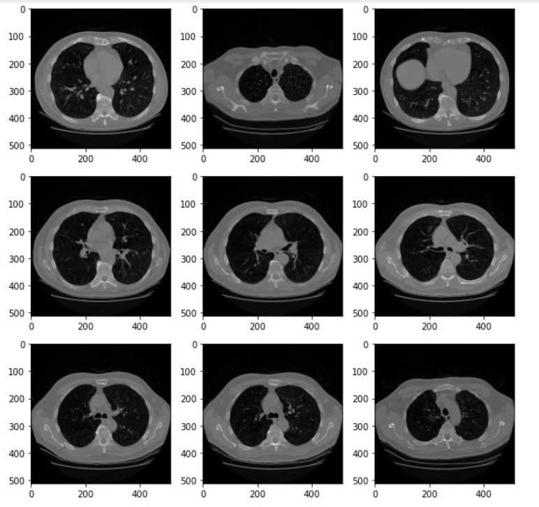
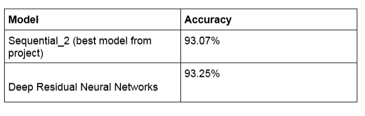

# AN EFFECTIVE APPROACH TO DETECT LUNG CANCER ON CT SCAN IMAGES  USING SEGMENTATION AND CONVOLUTIONAL NEURAL NETWORK   
# Table of Contents
1. [Introduction](#INTRODUCTION)
2. [Visualization of Dataset](#VISUALIZATION-OF-DATASET)
3. [Watershed Algorithm](#WATERSHED-ALGORITHM)
4. [Models Used](#MODELS-USED)
5. [Transfer Learning:VGG16-net](#TRANSFER-LEARNING)
6. [Conclusion and Results](#CONCLUSION-AND-RESULTS)
7. [Contributors](#CONTRIBUTORS)

# INTRODUCTION
Lung cancer is one of the deadliest cancers worldwide. However, the early detection of lung cancer significantly improves survival rate. Cancerous (malignant) and noncancerous (benign) pulmonary nodules are the small growths of cells inside the lung. Detection of malignant lung nodules at an early stage is necessary for the crucial prognosis . Early-stage cancerous lung nodules are very much similar to noncancerous nodules and need a differential diagnosis on the basis of slight morphological changes, locations, and clinical biomarkers . The challenging task is to measure the probability of malignancy for the early cancerous lung nodules . Various diagnostic procedures are used by physicians, in connection, for the early diagnosis of malignant lung nodules, such as clinical settings, computed tomography (CT) scan analysis (morphological assessment), positron emission tomography (PET) (metabolic assessments), and needle prick biopsy analysis . However, mostly invasive methods such as biopsies or surgeries are used by healthcare practitioners to differentiate between benign and malignant lung nodules. For such a fragile and sensitive organ, invasive methods involve lots of risks and increase patients’ anxieties.
The most suitable method used for the investigation of lung diseases is computed tomography (CT) imaging . However, CT scan investigation has a high rate of false positive findings, with carcinogenic effects of radiations. Low-dose CT uses considerably lower power radiation contact than standard-dose CT. The results show that there is no significant difference in detection sensitivities between low-dose and standard-dose CT images. However, cancer-related deaths were significantly reduced in the selected population that were exposed to low-dose CT scans as compared to chest radiographs, which is depicted in the National Lung Screening Trial (NLST) database . The detection sensitivity of lung nodules improves with sophisticated anatomical details (thinner slices) and better image registration techniques. However, this increases the datasets to a very large extent. Depending upon the slice thickness, up to 500 sections/slices are produced in one scan . An experienced radiologist takes approximately 2–3.5 min to observe a single slice . The workload of a radiologist increases significantly to screen a CT scan for the possible existence of a nodule. In addition to section thickness of the CT slices, detection sensitivity also depends on nodule features such as size, location, shape, adjacent structures, edges, and density.
Results show that only 68% of the time lung cancer nodules are correctly diagnosed when only one radiologist examines the scan, and are accurately detected up to 82% of the time with two radiologists. The detection of cancerous lung nodules at an early stage is a very difficult, tedious, and time-consuming task for radiologists. Screening a lot of scans with care requires plenty of time by the radiologist, meanwhile it is very much error-prone in the detection of small nodules .
To handle  this situation our first approach will be to make segmentation of CT scan images after preprocessing. We are using a watershed algorithm to make segmentation. Watershed algorithms make a mask for cancer cells in lung images. reference of an Article (“Serge Beucher and Fernand Meyer. The morphological approach to segmentation: the watershed transformation. In Mathematical Morphology in Image Processing (Ed. E. R. Dougherty), pages 433–481 (1993).”)
After successful making masks next step is to build a model on 	VGG16NET transfer learning model for better accuracy. At last both the trained and optimized model will be used and combined to make a complete final model for the classification of lung cancer. Taking reference of a paper “Deep learning for lung Cancer” by A. Asuntha & Andy Srinivasan.
  For the input layer, lung nodule CT images are used and are collected for various steps of the project. The source of the dataset is the LUNA16 dataset .
The LUNA16 dataset  is a subset of LIDC-IDRI dataset, in which the heterogeneous scans are filtered by different criteria. Since pulmonary nodules can be very small, a thin slice should be chosen. Therefore scans with a slice thickness greater than 2.5 mm were discarded. Furthermore, scans with inconsistent slice spacing or missing slices were also excluded. This led to 888 CT scans, with a total of 36,378 annotations by radiologists. In this dataset, only the annotations categorized as nodules ≥ 3 mm are considered relevant, as the other annotations (nodules ≤ 3 mm and non-nodules) are not considered relevant for lung cancer screening protocols . Nodules found by different readers that were closer than the sum of their radii were merged. In this case, positions and diameters of these merged annotations were averaged. This results in a set of 2290, 1602, 1186 and 777 nodules annotated by at least 1, 2, 3 or 4 radiologists, respectively. In Figure 1, different slices from a LUNA16 CT scan.

# VISUALIZATION OF DATASET
Visualization of dataset is an important part of training , it gives better understanding of dataset. But CT scan images are hard to visualize for a normal pc or any window browser. Therefore we use the pydicom library to solve this problem. The Pydicom library gives an image array and metadata information stored in CT images like patient’s name,patient’s id, patient’s birth date,image position , image number , doctor’s name , doctor’s birth date etc.
 Luna16 dataset is a directory which contains many subdirectories named on patient’s ids. A complete subdirectory is 3d image of lungs which is stored in around 180 2d image slices according to their image number. The link for stage1_train is given below:
 
 https://academictorrents.com/details/015f31a94c600256868be155358dc114157507fc

After combining all images in a single subdirectory according to their image it represents a 3d image. 3d image of lungs gives a vast idea about lung cancer cells  and other diseases in lungs . 

 

  

Metadata stored in CT scan images can be extracted from images with help of pydicom library. Information stored in one image is shown in the below figure.

  

# WATERSHED ALGORITHM

The watershed is a classical algorithm used for segmentation, that is, for separating different objects in an image.
a watershed is a transformation defined on a grayscale image. The name refers metaphorically to a geological watershed, or drainage divide, which separates adjacent drainage basins. The watershed transformation treats the image it operates upon like a topographic map, with the brightness of each point representing its height, and finds the lines that run along the tops of ridges.”The topological watershed” was introduced by M. Couprie and G. Bertrand in 1997
Starting from user-defined markers, the watershed algorithm treats pixels values as a local topography (elevation). The algorithm floods basins from the markers until basins attributed to different markers meet on watershed lines. In many cases, markers are chosen as local minima of the image, from which basins are flooded.
First , we extract internal and external markers from CT scan images with the help of binary dilations and add them with a complete dark image using watershed methods. And it removes external noise from the image and gives a watershed marker of lungs and cancer cells. As we can see in the below figure watershed marker removes external noise and applies a binary mask on the image , black pixels in lungs represent cancer cells.

  

For better segmentation we integrate sobel filter  with watershed algorithms .It removes the external layer of lungs. After removing the outer layer we use the internal marker and the Outline that was just created to generate the lungfilter using bitwise_or operations of numpy. It also removes the heart from CT scan images. Next step is to close off the lung filter with morphological operations and morphological gradients. It provides better segmented lungs than the previous process. We can see this process in the figure below.

  

By doing this we in total generated 1002 images with related labels which includes almost 12 patients CT scan data in which there are almost the same number of cancer and non-cancer patients.

# MODELS USED
The proposed model is a convolutional neural network approach based on lung segmentation on CT scan images. At first we  preprocess the dataset of luna16. After preprocessing, the next step is to make lung segmentation with a watershed algorithm. Watershed algorithm  highlights the lung part and makes binary masks for lungs using semantic segmentation approach. 
 
We tried three different models of Convolutional Neural Networks, which are based on the comparative study of performance of each type model in different dataset and for different classification problems.
## Sequential_1 : Manually Designed Model
Our first model “Sequential_1” is the basic simple approach of using the convolution layers, flatten fully connected layers, max pooling and dropout in the middle layers, which performs significantly well on the number classification problem.
Summary of model is given below:

  

## Sequential_2 : Manually Designed Model
Second model “Sequential_2” is the Deep Convolutional Neural Network with Max Pooling and Fully connected layers in the end. This model with specified number of elements and layers performed best in many research papers with different datasets.
Summary of model is given below:

  
  

## VGG16-net : Transfer Learning
Third and the last model approach was to use transfer learning on VGG-16 with some changes in the last three layers which are fully connected. This model gives appreciable results in object classification.
Summary of model is given below:

  
  

Important Information regarding the training model:
After making successful binary lung segmented masks, we train models on segmented lungs with a batch size of 32 for image data generator and using 100 images in each epoch for 30 epochs with exception of 500 images in each epoch for VGG-16. We are training images with the shape of (512,512,1) for the first two models and the shape of (512,512,3) for VGG-16. For a better result data augmentation is used to train models on different augmentation like shear range , zoom range , horizontal flip , rotation range , centre shift etc. For the end layer we used a single node for binary c;assification as we want to classify between cancer and non- cancer lungs.
Also we used the callbacks from tensorflow keras to save the best accuracy model so that we can run a complete 50 epoch training session to plot the comparison graphs.

# TRANSFER LEARNING : VGG16-NET
VGG Net is the name of a pre-trained convolutional neural network (CNN) invented by Simonyan and Zisserman from Visual Geometry Group (VGG) at University of Oxford in 2014 and it was able to be the 1st runner-up of the ILSVRC (ImageNet Large Scale Visual Recognition Competition) 2014 in the classification task. VGG Net has been trained on ImageNet ILSVRC dataset which includes images of 1000 classes split into three sets of 1.3 million training images, 100,000 testing images and 50,000 validation images. The model obtained 92.7% test accuracy in ImageNet. VGG Net has been successful in many real world applications such as estimating the heart rate based on the body motion, and pavement distress detection .

  

VGG Net has learned to extract the features (feature extractor) that can distinguish the objects and is used to classify unseen objects. VGG was invented with the purpose of enhancing classification accuracy by increasing the depth of the CNNs. VGG 16 and VGG 19, having 16 and 19 weight layers, respectively, have been used for object recognition. VGG Net takes input of 224×224 RGB images and passes them through a stack of convolutional layers with the fixed filter size of 3×3 and the stride of 1. There are five max pooling filters embedded between convolutional layers in order to down-sample the input representation (image, hidden-layer output matrix, etc.). The stack of convolutional layers are followed by 3 fully connected layers, having 4096, 4096 and 1000 channels, respectively. The last layer is a soft-max layer . Below figure shows VGG network structure.

But in this approach we have images with the shape of (512,512) . so we build our own model using vgg16-net architecture. And compile the model with a powerful adam optimizer , learning rate is 0.0001 , entropy is binary_crossentropy and accuracy metrics. The  below  figure shows model summary , convolution layers, maxpooling layers and params.

  
  

# CONCLUSION AND RESULTS

Following are the graphs of accuracy and loss from the three models used for classification in our project.
Model: Sequential_1

  
  

Model: Sequential_2

  
  

Model: VGG_16

  
  

Tabular Comparison of model training accuracy and loss and model validation accuracy and loss:
Note: we are showing the best val. acc. related information in all models as the callbacks function will save only the best accuracy model.

  

## Results:
From the Results shown adobe in graphs and the comparison table we can conclude the following things:
1. The Sequential_1 model is performing the worst overall and even getting over trained without reaching the satisfactory amount of validation accuracy though the validation loss is least but this is a classification problem so it focuses more on accuracy.
2. Sequential_2 and VGG_16 are performing good when training the model and reaching appreciable levels of test accuracy and test loss but in validation Sequential is performing better in terms of accuracy as compared to VGG_16 but loss is less in VGG_16.
3. The poor performance of transfer learning can be due to 2 main reasons, which are less amount of training data in one epoch due to limited amount of resources and time and bad data input to the VGG_16. Both the topics are discussed in the Challenges Section.

## Tabular comparison of the best accuracy model with some other models from from other research papers for binary classification:

Note: There were also some challanges with the dataset which can be overcomed in the future verssion code i.e. The code and the improvement in the results will be updated in the future versions of python notebooks.

Note (new) : There were some updates in the codes which is updated in the newer version of the python notebook "lung_cancer.ipynb" and "Lungcancer_1.ipynb" which includes the code for lung cancer nodule detection and the older version also. This part of nodeule detection is not explained above. The link to the dataset for both the new and older python notebooks is given in the dataset folder.  

# Contributors
> Divyanshu Bhaik 
> Harit Yadav
